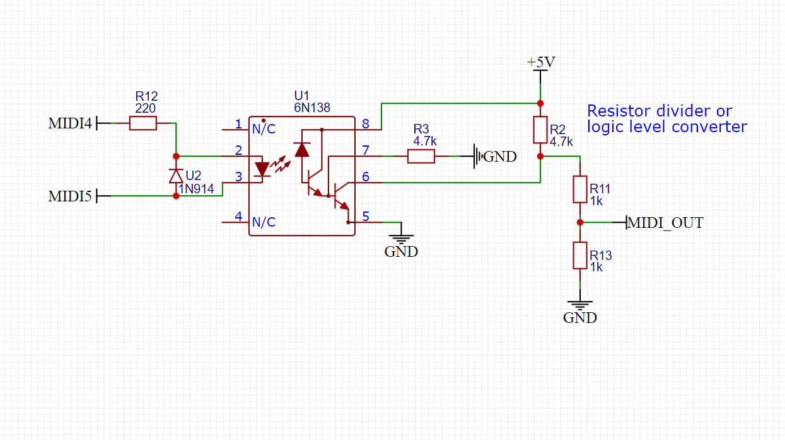
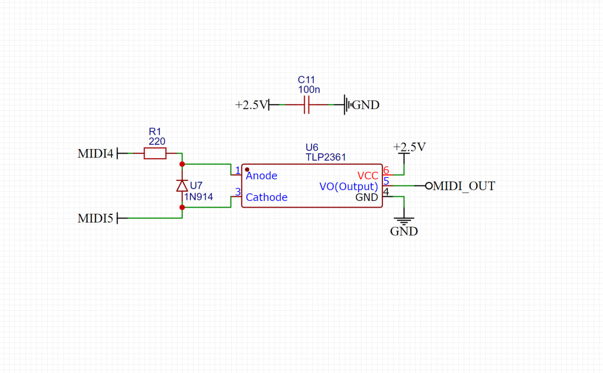

# PSP Midi Synth 

## Synthesizer app

- Midi IN (with pitch bend)

- 4 voices

- 4 waveforms: square, sawtooth, triangle, sine

- ADSR, filter

- 5 presets (to save the preset, press triangle)
logic level converter
#### Video demonstration
link

## MIDI IN / UART port 

The PSP has a SIO port exposed via its headphones port. You can send MIDI commands to the RX pin and the PSP will read them.

### WARNING!

MIDI cannot be sent directly, an optocoupler circuit is required.

Signal levels must be matched! For the PSP1000: it's 2.5 volts, for the 2000/3000: it's 1.9 volts. You can use logic level converter for this. 

More info about this port: https://mc.pp.se/psp/phones.xhtml

## Hardware 

Purchase an official media remote to harvest its cable (pick the right one for you model PSP)

Alternatively, you can route a PCB with traces for this port. My 1.6mm thick PCB fits in and holds well.

### Schematic 

I haven't been able to develop easily repeatable PCB adapter for connecting MIDI to the PSP, so I would be glad to hear suggestions for a good solution to the problems

The main problem for a PCB adapter is that the voltage of 2.5 (or 1.9)  appears only if the 3.5 mm jack is plugged into the socket. 

I was hoping to build a PCB with an optocoupler to connect MIDI to the PSP and get 2.5 volts to power the optocoupler, but the voltage doesn't appear without a jack plug connected. The PCB is also thick, so I can't use regular 3.5 cables; I need a suitable one with a very thin housing. 
At the moment I am powering the optocoupler via an external USB, reducing the voltage from 5 volts to 2.5

#### MIDI IN shematics 

## Installing the program on a PSP

Copy "PSP_MidiSynth" folder to PSP /PSP/GAME/ 

### Compile 

Setup the PSPSDK [https://pspdev.github.io/installation.html](https://pspdev.github.io/installation.html)

In the `PSP` folder run the command `make`. This will compile the PSP code.

Compiled program will be saved in "PSP_MidiSynth"

---

# Links and great thanks!

- This project is based on this example https://github.com/ste2425/PSP-Serial-Example

- I recommend checking out their project https://www.youtube.com/watch?v=9r6rsSNpkjs

- MIDI Synth demonstration video https://www.youtube.com/watch?v=WZJZkFJ37xU

- In 2008, MIDI was connected to the PSP, so I'm not the first https://www.youtube.com/watch?v=5dN_RP0IBAg

- UART port info https://mc.pp.se/psp/phones.xhtml

